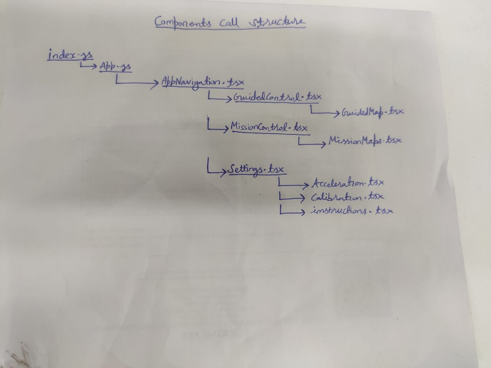

# IDEX PROJECT

## ANDROID APP TO CONTROLL THE DRONES

# PROJECT REQUIREMENTS

- Os - Linux preferred Ubuntu 22.04 LTS
- Node - v18.12.1

# Project Setup

1. cd idex-project-android-app
2. npm install
3. npm start

# Directory Structure

## src - This folder contains source folders for frontend code

### Components

- Camera.tsx: Shows real time camera feedback from the drone
- DraggableCamera.tsx: Makes camera component draggable
- GuideMap.tsx: Contains map for guided mode
- LeftSidebar.tsx: Left side bar to show the drones real time data .
- MissionMaps.tsx: Contains map for mission  mode
-

### Navigations

- AppNavigation.tsx: Its a nav bar of the android app .

### Pages

- Below pages are the Container for the guided and mission operations.

- GuidedControl.tsx: Control the drones in guided mode and sent them to any targeted location.

- MissionControl.tsx: Control the drones in auto mission mode and drones follow the given waypoints.

### Settings

- Acceleration.tsx: Contains the accelerometer calibration part.
- Calibration.tsx: Contains the mag calibration part.
- instructions.tsx: Contains the instruction to use the app.
- video.tsx: Used for testing purpose and further remove in future.
  
### Styles

- It contains the css of the components used in the app.

## android>app>src>main>java>com>drone250gm>Mavlink

- Contains mavlink library with all the mavlink message definitions.

## android>app>src>main>java>com>drone250gm

### It contains the react native modules

- ConnectionModule.java: contains receiveUDP function Thread which sends mavlink request messages and receives telemetry data from the system.
  
- MavlinkCommand.java: contains all the mavlink messages which send mavlink command messages to system.
  
- MissionModule.java: It is used to handle mission messages .

- socketModule.java: contains the datagram socket port and handles all the packet of messages received from the system.

## Components Structure

 
  
